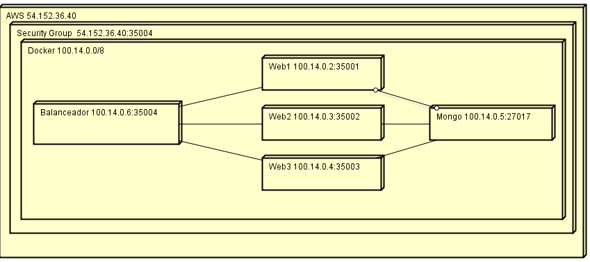
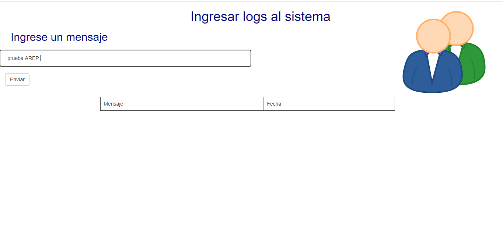
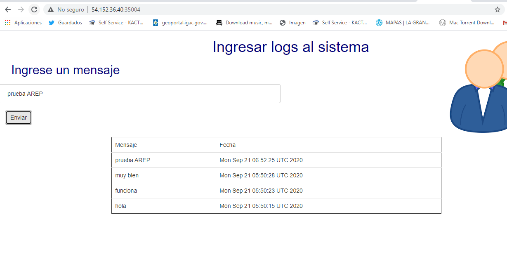

# Taller de de modularización con virtualización e Introducción a Docker y a AWS #

## Despliegue en AWS ## 

http://54.152.36.40:35004/

## Despliegue CircleCi ##

[](https://app.circleci.com/pipelines/github/JulianGutierritos/AREP-LAB5)

## Prerrequisitos ##

La persona que quiera utilizar este programa debe tener conocimientos básicos en Java, Maven y debe contar con conocimientos en Docker. 
Para compilar y ejecutar el programa localmente debe tener: 

- Java 8

- Maven 3.6.3

- Docker

## Herramientas utilizadas para el desarrollo ##

Para el desarrollo de este programa se utilizó: 

- Java: Fue el lenguaje de programación utilizado para el desarrollo.

- Maven: Fue la herramienta utilizada para la gestión y construcción del programa.

- Docker: Fue la herramienta usada para crear los contenedores que faciliten su ejecución


## Descripción ## 

Este programa le permite a los usuarios ingresar logs en una base de datos Mongo. El usuario, a la vez que ingresa un nuevo mensaje, puede visualizar los últimos 10 mensajes registrados en el sistema.

## Modelo ##


La aplicación consta de dos programas en java: uno llamado "webapp" que se encarga de ingresar y sacar información de la base de datos Mongo; el otro programa, es un balanceador que se encarga de dividir las peticiones equitativamente entre las tres instancias del primer programa.

Toda la aplicación se encuentra desplegada en AWS y se utilizaron contenedores Docker.

## Instrucciones para compilar, ejecutar y generar documentación de "web" y "balanceador" ##

Para compilar el programa, se debe primero ubicar en la carpeta del archivo ("web" o "balanceador")  y posteriormente ejecutar el siguiente comando: 

```
   mvn package 
```

Una vez compilado el programa, lo siguiente es ejecutarlo. Para esto, otra vez ubicado en la carpeta del programa, ejecute el siguiete comando:

```
   java -cp target/classes:target/dependency/* edu.eci.arep.Main
```

Si desea generar una nueva documentación, debe ejecutar los siguientes comandos:

```
   mvn javadoc:javadoc
   mvn javadoc:jar
   mvn javadoc:aggregate
   mvn javadoc:aggregate-jar
   mvn javadoc:test-javadoc
   mvn javadoc:test-jar
   mvn javadoc:test-aggregate
   mvn javadoc:test-aggregate-jar
```

Vale recalcar que el programa ya cuenta con archivos de documentación ubicados en la carpeta "Documentacion".

## Ejecutar el programa completo (usando docker) ##

Para ejecutar todo el programa localmente, se debe contar con Docker instalado y corriendo, pararse en el directorio raíz del programa y ejecutar los siguientes comandos:

```
   docker pull juliangutierrez/sparkdocker_app
   docker pull juliangutierrez/sparkdocker_balanceador
   docker-compose up -d
```

Una vez hecho esto, el programa se ejecutara localmente y podrá ser accedido mediante: http://localhost:35004

## Prueba funcionamiento AWS ## 

A continuación, se muestran dos pantallas de cómo se ve el programa antes y después de insertar un mensaje. Esta inserción se hace en el programa desplegado en AWS.






## Recursos ## 
A continuación, se listan los recursos estáticos que se pueden obtener con get: 

- /index.html 
- /404.html 
- /js/api.js
- mystyle.css 
- /usuarios.png

En seguida, se listan las solicitudes post que atiende el programa: 

- /addMensaje


## Licencia ## 

La licencia de este proyecto es: [**GNU General Public License v3.0**](LICENSE)

## Autor ##

Julián David Gutiérrez Vanegas
